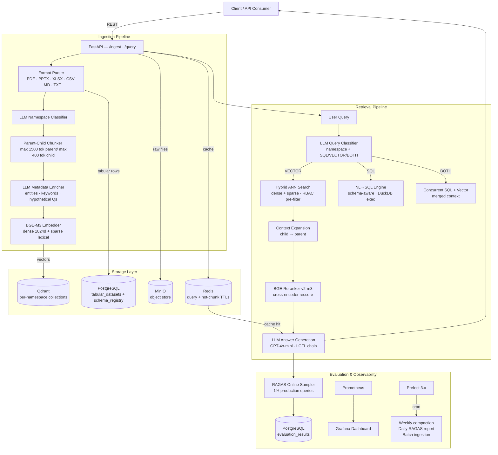

<div align="center">

# ⚡Document Aware RAG System

### *Enterprise-grade Retrieval-Augmented Generation — Designed for production.*

</div>

---

## 🎯 The Problem This Solves

Most RAG demos fall apart in production. They embed everything into one undifferentiated vector blob, can't answer questions about structured data (spreadsheets, databases), have no quality guarantees, and expose every document to every user.

**AdvancedRAG** is engineered from the ground up for the real enterprise environment: multi-format document ingestion, intelligent query routing between vector search and SQL execution, role-based access control, live quality evaluation, and a full observability stack — all self-hosted, all production-ready.

---

## 🏗️ System Architecture




---

## ✨ Advanced Engineering Highlights

| Feature | Implementation Detail |
|---|---|
| 🔀 **Intelligent Query Router** | Single LLM call classifies query into namespace(s) + route destination (`SQL` / `VECTOR_STORE` / `BOTH`). Schema registry is fetched live from PostgreSQL — zero hardcoded table names. |
| 🧩 **Parent-Child Chunking** | Children (max ~400 tokens) are retrieved via ANN for precision; at query time they are expanded to parent sections (max ~1500 tokens) before reranking, giving the cross-encoder richer context without recall loss. |
| 🔍 **Hybrid Dense + Sparse Search** | BGE-M3 produces dense (1024-dim) and sparse (lexical weight) vectors in a single forward pass. Qdrant fuses both via Reciprocal Rank Fusion — combining semantic understanding with keyword precision. |
| 🎯 **Self-Hosted Cross-Encoder Reranker** | BGE-Reranker-v2-m3 rescores all candidates jointly with the query. Applied *after* context expansion — richer sections yield better reranker precision. Falls back to `sentence-transformers` gracefully. |
| 🛡️ **Vector-Level RBAC** | `access_roles` stored as Qdrant payload. Pre-filters (not post-filters) enforce access *before* ANN search — no performance penalty, no data leakage. Cache is scoped per `(query, sorted_roles)` tuple. |
| 🗄️ **Tables Never Touch the Vector Store** | CSV/XLSX rows go directly to PostgreSQL. An LLM-generated description per table is registered in `schema_registry`. The query router uses these descriptions to select relevant tables for NL→SQL execution — preventing hallucination from embedded tabular data. |
| 🤖 **HyDE-Style Enrichment** | Each chunk is enriched with `hypothetical_questions` — synthetic questions this chunk can answer. These are embedded and indexed alongside chunk text, boosting retrieval recall for paraphrased or indirect queries. |
| 📊 **RAGAS Quality Gate** | 1% of production queries are evaluated asynchronously (zero latency impact). Offline CI/CD gate evaluates 4 metrics (`faithfulness`, `answer_relevancy`, `context_precision`, `context_recall`) with configurable fail thresholds — blocks broken releases. |
| ⚡ **Redis Semantic Cache** | Query + role set → Redis lookup before any GPU/LLM compute. 30-minute TTL for responses, 5-minute TTL for hot chunks. Saves cost, cuts P99 latency to sub-5ms on repeated queries. |
| 🔁 **Event-Driven Ingestion** | Kafka consumer (`aiokafka`) listens to `rag.ingestion.documents` topic. Decouples upload from processing — supports burst ingestion without API timeouts. |
| 🧹 **Content-Hash Deduplication** | SHA-256 hash computed on chunk text before every Qdrant upsert. Re-ingesting the same document does not create duplicate vectors. |
| 🔄 **Namespace Description Growth** | Each indexed document appends an LLM-generated snippet to its namespace description in PostgreSQL. The query classifier always reads a live, evolving description — routing improves automatically as the knowledge base grows. |

---

## 🛠️ Tech Stack

**Core AI / ML**
| Component | Technology |
|---|---|
| LLM (generation, classification, enrichment) | OpenAI GPT-4o-mini via LangChain LCEL |
| Embeddings | BAAI/BGE-M3 (FlagEmbedding) — self-hosted |
| Reranker | BAAI/BGE-Reranker-v2-m3 — self-hosted cross-encoder |
| NLP Fallback | spaCy 3.8 (NER when LLM enrichment fails) |

**Backend**
| Component | Technology |
|---|---|
| API Framework | FastAPI 0.115 + Uvicorn |
| Data Validation | Pydantic v2 + Pydantic Settings |
| Async ORM | SQLAlchemy 2.0 (asyncio) + asyncpg |
| NL→SQL Execution | DuckDB 1.x + PostgreSQL |

**Storage**
| Component | Technology |
|---|---|
| Vector Database | Qdrant v1.13.6 |
| Relational Database | PostgreSQL 17 |
| Object Store | MinIO (S3-compatible) |
| Cache | Redis 7.4 LTS |
| Message Queue | Apache Kafka (Confluent 7.8) |

**Document Parsers**
| Format | Library |
|---|---|
| PDF(Text + Tables + Images) | PyMuPDF 1.25 + pdfplumber |
| PPTX | python-pptx |
| XLSX / XLS | openpyxl + pandas |
| CSV / TSV | pandas |
| DOCX | python-docx |
| HTML | BeautifulSoup4 |
| Markdown | markdown-it-py |

**DevOps & Observability**
| Component | Technology |
|---|---|
| Containerization | Docker + Docker Compose |
| Workflow Orchestration | Prefect 3.x (cron flows) |
| Metrics | Prometheus 3.x + prometheus-fastapi-instrumentator |
| Dashboards | Grafana 11.x |
| Evaluation Framework | RAGAS 0.2.x |
| Structured Logging | structlog |
| Retry Logic | Tenacity (exponential backoff) |

---

## 🚀 Quick Start

**Prerequisites:** Python 3.12, Docker, Docker Compose

### Step 1 — Clone & Configure

```bash
git clone https://github.com/yourusername/advancedrag.git
cd advancedrag
cp .env.example .env
# → Open .env and set OPENAI_API_KEY=sk-...
```

### Step 2 — Launch Infrastructure

```bash
docker compose up -d
# Starts: Qdrant · PostgreSQL · Redis · MinIO · Kafka · Prometheus · Grafana
```

### Step 3 — Install & Run

```bash
python -m venv .venv && source .venv/bin/activate   # Windows: .venv\Scripts\activate
pip install -r requirements.txt
python -m spacy download en_core_web_sm
uvicorn src.api.app:app --reload --port 8000
```

> API is live at `http://localhost:8000` · Docs at `http://localhost:8000/docs`
> Grafana dashboard at `http://localhost:3000` (admin / admin123)

---

## 📡 API Reference

### Ingest a Document

```bash
curl -X POST http://localhost:8000/ingest \
  -F "file=@/path/to/your/document.pdf" \
  -F "namespace=PRODUCTS" \
  -F "access_roles=EMPLOYEE,MANAGER"
```

### Query the Knowledge Base

```bash
curl -X POST http://localhost:8000/query \
  -H "Content-Type: application/json" \
  -d '{
    "query": "What is the uptime SLA for Enterprise customers?",
    "user_roles": ["EMPLOYEE"]
  }'
```

**Response:**
```json
{
  "answer": "TechFlow guarantees 99.95% monthly uptime for Enterprise cloud deployments...",
  "query_type": "semantic",
  "namespaces": ["PRODUCTS"],
  "sources": [{ "source_id": "...", "score": 0.94, "section": "SLA Policies" }],
  "latency_ms": 312.4,
  "cached": false
}
```

---

## 📁 Project Structure

```
advancedrag/
├── src/
│   ├── api/                    # FastAPI app, endpoints, Prometheus metrics
│   ├── core/                   # Config (Pydantic Settings), models, logging
│   ├── ingestion/
│   │   ├── parsers/            # PDF, PPTX, XLSX, CSV, TXT, Markdown plugins
│   │   ├── chunkers/           # Parent-child chunking utilities
│   │   ├── enricher.py         # LLM metadata enrichment + spaCy fallback
│   │   ├── table_describer.py  # LLM-generated SQL table descriptions
│   │   └── service.py          # 9-step ingestion orchestrator
│   ├── retrieval/
│   │   ├── query_classifier.py # LLM router: namespaces + SQL/VECTOR/BOTH
│   │   ├── nl_to_sql.py        # Natural language → SQL engine
│   │   ├── rerankers/          # BGE-Reranker-v2-m3 cross-encoder
│   │   └── pipeline.py         # Full retrieval orchestration
│   ├── storage/
│   │   ├── vector/             # Qdrant store + BGE-M3 embedder
│   │   ├── sql/                # PostgreSQL async store
│   │   ├── cache/              # Redis store
│   │   └── object/             # MinIO store
│   ├── evaluation/
│   │   ├── ragas_evaluator.py  # Online + offline RAGAS evaluation
│   │   └── test_dataset.json   # CI/CD regression test queries
│   └── monitoring/
│       └── prefect_flows.py    # Scheduled flows: compaction, ingestion, reports
├── configs/                    # Qdrant, Redis, Prometheus config files
├── scripts/                    # PostgreSQL init SQL
├── docker-compose.yml
├── requirements.txt
└── .env.example
```

---

## 🧪 Running Evaluations

**Online** (automatic — 1% of production queries sampled):
```bash
# Configured via RAGAS_ENABLED=true and RAGAS_SAMPLE_RATE=0.01 in .env
```

**Offline CI/CD gate:**
```bash
python -m src.evaluation.ragas_evaluator --dataset src/evaluation/test_dataset.json --threshold 0.7
```

Example output:
```
═══════════════════════════════════════════════════════
  RAGAS EVALUATION RESULTS
═══════════════════════════════════════════════════════

📊 SQL Path (8 questions):
  answer_relevancy     : 0.9120

📄 Vector Path (12 questions):
  faithfulness         : 0.8840
  answer_relevancy     : 0.9210
  context_precision    : 0.8650
  context_recall       : 0.8430

═══════════════════════════════════════════════════════
```

---

## ⚙️ Configuration Reference

Key environment variables (see `.env.example` for full list):

| Variable | Default | Description |
|---|---|---|
| `OPENAI_API_KEY` | *required* | OpenAI API key |
| `OPENAI_MODEL` | `gpt-4o-mini` | Model for answer generation & routing |
| `EMBEDDING_DEVICE` | `cpu` | `cpu` / `cuda` / `mps` |
| `CHILD_CHUNK_SIZE` | `400` | Child chunk target tokens |
| `PARENT_CHUNK_SIZE` | `1500` | Parent section target tokens |
| `RETRIEVAL_TOP_K` | `20` | ANN candidates before reranking |
| `RERANKER_TOP_N` | `5` | Final chunks after reranking |
| `MIN_SIMILARITY_SCORE` | `0.45` | Below this → "no relevant information" |
| `QUERY_CACHE_TTL` | `1800` | Redis cache TTL (seconds) |
| `RAGAS_SAMPLE_RATE` | `0.01` | Fraction of live queries evaluated (1%) |

---

## 🗺️ Roadmap

- ⚡ Type-Safe Prompting: Transition all LLM prompts to Pydantic-based schemas (via Instructor or LCEL) to enforce strict validation and eliminate parsing errors.

- 🖼️ Visual Intelligence: Activate pre-wired hooks for Multimodal Ingestion, enabling OCR and vector indexing for images and embedded document figures.

- 📈 Evals Optimization: Fine-tune retrieval hyperparameters to push RAGAS Faithfulness and Recall thresholds above 0.95 through iterative dataset testing.

- ⚙️ System Extensibility: Refactor the ingestion pipeline to support pluggable transformation modules, allowing for easier custom pre-processing logic.
---

## 🤝 Contributing

Contributions are welcome. Please open an issue first to discuss what you'd like to change.

```bash
# Fork → feature branch → PR against main
git checkout -b feature/your-feature-name
```

---

<div align="center">

**Built by [Kartik Pawade](https://your-portfolio.com)**

[](https://www.linkedin.com/in/kartik-pawade/)

*If this project helped you, consider giving it a ⭐*

</div>
